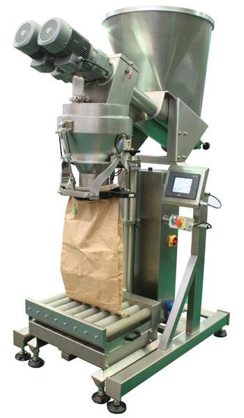
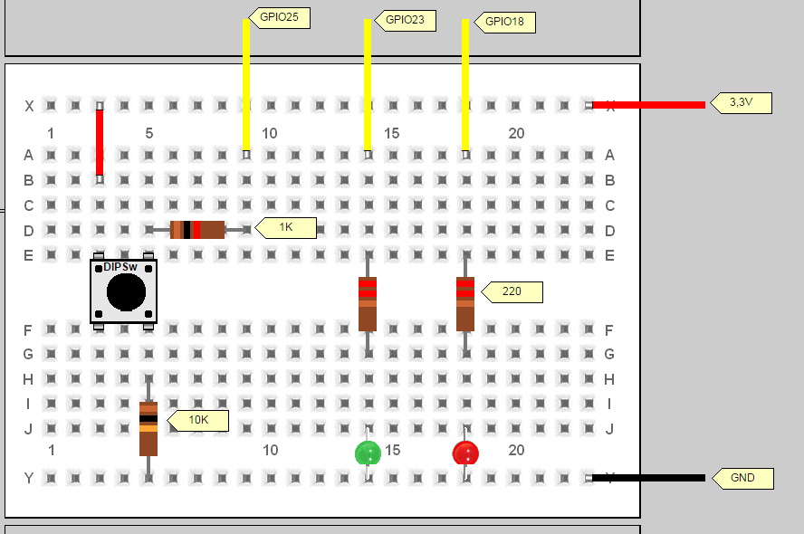

### IOT Demo

Demo iot application that simulates a bag filling machine.



The actual setup consists of two leds and a button and simulates the following simple steps:
1. Start filling prossess with button
2. Red led is signaling ongoing filling
3. Green led is signaling that bag is filled and can be shipped
4. Order is marked as shipped in the backend software



### Deploy with Kubernetes

Execute the following command against the Kubernetes API server. The demo application will be deployed automatically on all RaspberryPI devices

```shell
$ kubectl create -f https://raw.githubusercontent.com/fest-research/demo-raspi/master/assets/packing-daemonset.yaml
```

### Run from Source

SSH into the Raspberry. Run the follwoing commands

```shell
$ sudo apt-get update 
$ sudo apt-get install python python-dev python-rpi.gpio
$ python src/packingdesk.py 
```


### Travis

Travis CI [https://travis-ci.org/fest-research/demo-raspi]

